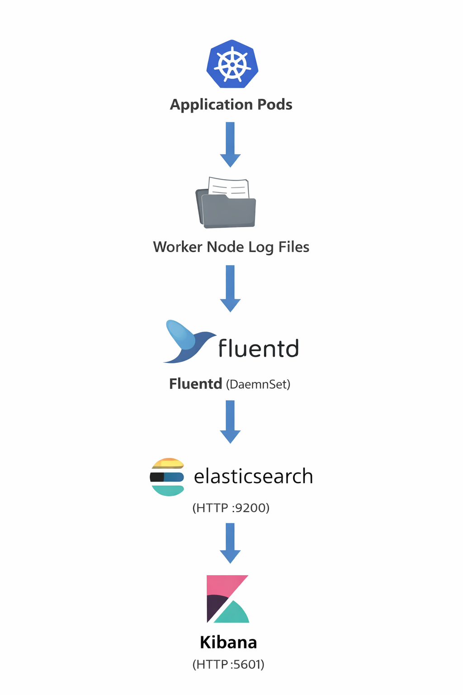
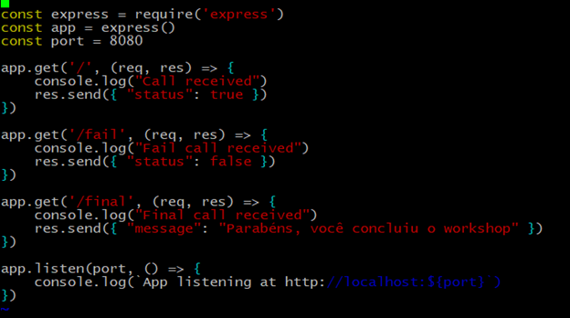
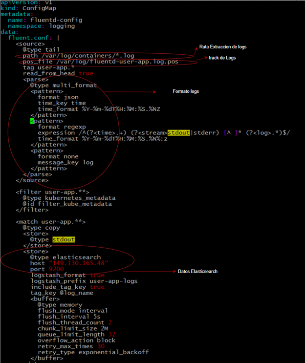
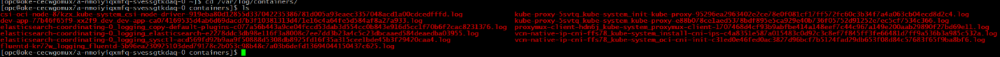
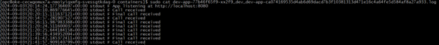
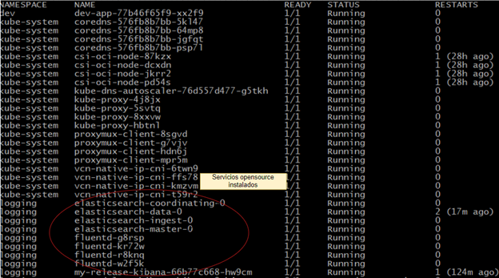
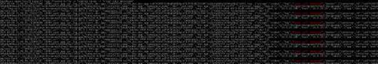
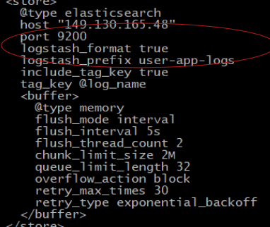
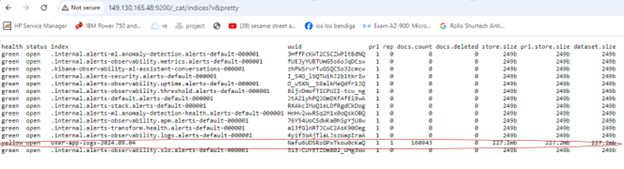
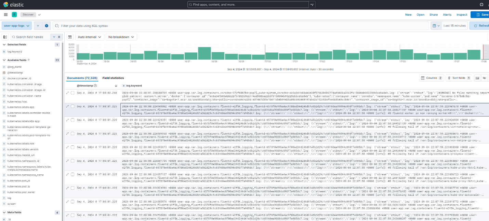

# Kubernetes Logging Architecture with Fluentd, Elasticsearch, and Kibana (EFK Stack)

## Introduction

This tutorial explains a common **Kubernetes logging architecture** where application and pod logs are collected using **Fluentd**, stored in **Elasticsearch**, and visualized with **Kibana** (EFK Stack).

In this model:

- Logs are generated by Pods and applications.
- Fluentd runs as a DaemonSet and collects logs from worker nodes.
- Logs are sent to Elasticsearch.
- Kibana queries Elasticsearch to visualize logs.

> Important: Fluentd, Elasticsearch, and Kibana are **open-source tools** installed inside the **Oracle Kubernetes Engine**.  
> The **customer is responsible** for installing, configuring, and maintaining these components.

Oracle Cloud Infrastructure (OCI) is not responsible for these open-source deployments, although OCI provides managed alternatives such as **OCI OpenSearch Service**.

---

## Architecture Overview




---

## Alternative Architecture (Managed Service)

Instead of self-managing Elasticsearch, customers may use:

- OCI OpenSearch Service (managed by Oracle)

Example reference:  
https://blogs.oracle.com/cloud-infrastructure/post/using-oci-opensearch-ingest-logs-from-kubernetes-using-fluentbit-and-fluentd

In this case:

- Oracle manages the OpenSearch infrastructure.
- The customer remains responsible for Fluentd/Fluent Bit configuration and application-level logging.

---

## How Logs Are Generated

Kubernetes automatically captures:

- `stdout`
- `stderr`

from containers.

If an application prints logs using a logging library, those logs become visible in the Pod logs.

### Example (Node.js)

```
console.log("User login successful");
console.error("Database connection failed");
```



View logs:

```
kubectl logs <pod-name>
```


These logs are stored on the worker node filesystem and later collected by Fluentd.


---

## Installing EFK Components

Typical Kubernetes manifests:

- fluentdConfigMap.yaml

- fluentdDaemonSet.yaml

- fluentdRBAC.yaml


Ensure you have sufficient Kubernetes privileges to create DaemonSets, Services, ConfigMaps, and RBAC resources.


You may also use Helm charts for simpler installation, example for elasticsearch and kibana.

```
helm repo add bitnami https://charts.bitnami.com/bitnami
helm repo update

```
**Installing Elasticsearch**

```
helm install elasticsearch --set name=elasticsearch,master.replicas=3,service.type=LoadBalancer bitnami/elasticsearch
```

**Installing Kibana**
```
helm install -kibana elastic/kibana --set  name=elasticsearchHosts=http://<ELASTICSEARCH_IP>:9200,service.type=LoadBalancer
```
---


### Network Requirements

Verify VCN and subnet connectivity:

- Fluentd → Elasticsearch (TCP 9200)

- Kibana → Elasticsearch (TCP 9200)

- Browser → Kibana (TCP 5601)


---

**Ensure:**

- Subnets allow required CIDR ranges

- Security Lists / NSGs allow required ports

- No firewall rules block traffic


---


### Fluentd Configuration (Key Point)

Fluentd uses three main YAML files:

- fluentdConfigMap.yaml

- fluentdDaemonSet.yaml

- fluentdRBAC.yaml

The most important file is:

- fluentdConfigMap.yaml

It defines:

- Where logs are read from

- Log format

- Elasticsearch destination

```
<source>
  @type tail
  path /var/log/containers/*.log
  pos_file /var/log/fluentd-containers.log.pos
  tag kubernetes.*
  format json
</source>
```




---

### Important: Validate Log Path on Worker Node

Logs are stored on worker nodes, not inside application pods.

SSH into a worker node and verify:

```
ls /var/log/containers
```

You should see logs such as:

```
dev-app-xxxxx.log
fluentd-xxxxx.log
kibana-xxxxx.log
```





If application logs appear here, Fluentd can collect them.


---

### Verify Fluentd Is Receiving Logs
Check Fluentd pod:

```
kubectl get pods -n logging
kubectl logs <fluentd-pod>
```






Look for messages showing logs being forwarded to Elasticsearch.


---

### Verify Elasticsearch Indices

Elasticsearch automatically creates indices based on Fluentd configuration.

Fluentd Configuration yaml file:



Run:

```
http://<ELASTICSEARCH_IP>:9200/_cat/indices?v&pretty
```

If indices appear, Fluentd → Elasticsearch communication is working.




---

### Verify Logs in Kibana
Open:

```
http://<KIBANA_IP>:5601
```
Steps:

- Create Index Pattern

- Select Fluentd index

- Open Discover

- Filter by application name


You should see application logs such as:



**Troubleshooting Checklist**

- All pods in Running state

- Fluentd logs show no errors

- Elasticsearch reachable on port 9200

- Kibana reachable on port 5601

- Correct log path in Fluentd ConfigMap

- Indices exist in Elasticsearch


**Responsibilities**

Customer is responsible for:

- Installing EFK stack

- Configuration

- Scaling

- Maintenance

- Upgrades


OCI is responsible  for underlying infrastructure (VMs, networking, storage, Cluster OKE).


---

**Conclusion**

This tutorial demonstrates how Kubernetes logs generated by application pods can be:

- Collected by Fluentd

- Stored in Elasticsearch

- Visualized in Kibana

When properly configured, this architecture provides full observability of application behavior inside Kubernetes clusters.

---

## Author

**Ivan Vasquez**  
LAD A-Team Cloud Solution Specialist  
Oracle Cloud Infrastructure (OCI)
